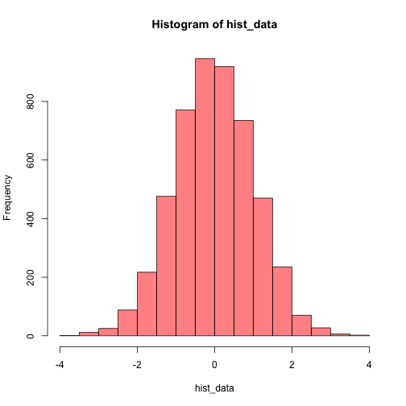
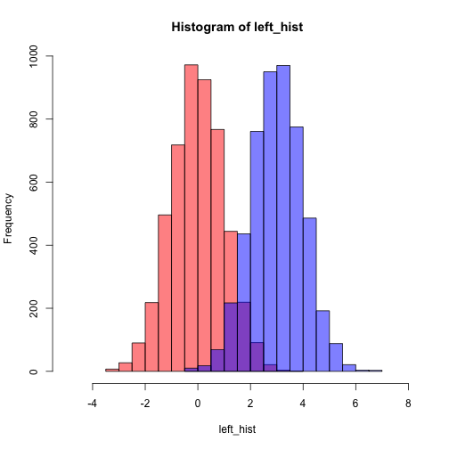
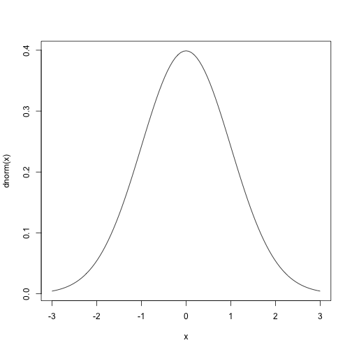
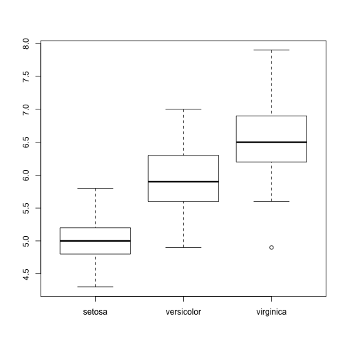
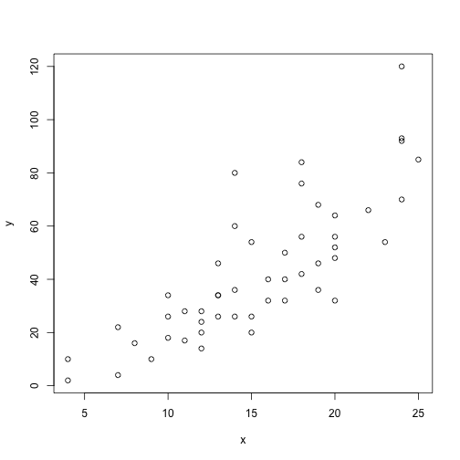
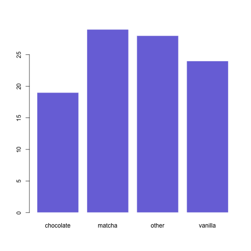
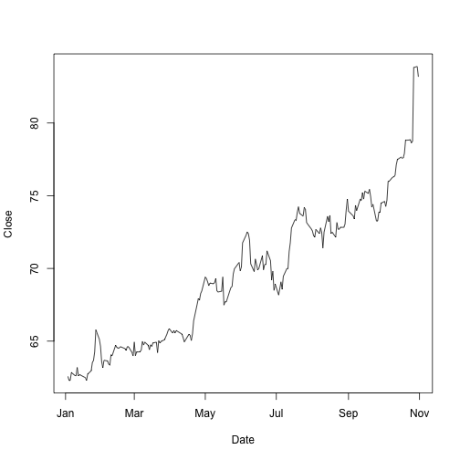

Base Plotting System
========================================================
author: 郭耀仁
date: 2017-11-06
autosize: true

視覺化的力量
========================================================

- [Hans Rosling](https://www.youtube.com/watch?v=jbkSRLYSojo)

> He rose to international celebrity status after producing a [Ted Talk](https://www.ted.com/talks/hans_rosling_shows_the_best_stats_you_ve_ever_seen?language=zh-tw) in which he promoted the use of data to explore development issues.
> [Hans Rosling - Wikipedia](https://en.wikipedia.org/wiki/Hans_Rosling)

視覺化的力量
========================================================

- Less than 5 minutes
- 200 years
- 200+ countries
- 120,000+ observations

R 語言的繪圖系統
========================================================

- 靜態
  - **Base Plotting System**
  - ggplot2
- 動態
  - plotly
  - shiny

圖形目的
========================================================

- 分配
- 相關
- 排名
- 時間序列

分配
========================================================

- 直方圖
- 密度圖
- 盒鬚圖

直方圖
========================================================

- `hist()` 函數


```r
hist_data <- rnorm(5000)
hist(hist_data, col = rgb(1, 0, 0, 0.5))
```



直方圖（2）
========================================================


```r
left_hist <- rnorm(5000)
right_hist <- rnorm(5000, mean = 3)
hist(left_hist, col = rgb(1, 0, 0, 0.5), xlim = c(-5, 8))
hist(right_hist, col = rgb(0, 0, 1, 0.5), add = TRUE)
```



密度圖
========================================================

- `curve()` 函數


```r
curve(dnorm, from = -3, to = 3)
```



盒鬚圖
========================================================

- `boxplot()` 函數


```r
boxplot(Sepal.Length ~ Species, data = iris)
```



相關
========================================================

- 散佈圖

散佈圖
========================================================

- `plot()` 函數


```r
x <- cars$speed
y <- cars$dist
plot(x, y)
```



排名
========================================================

- 長條圖

長條圖
========================================================

- `barplot()` 函數


```r
ice_cream_flavor <- rep(NA, times = 100)
for (i in 1:100){
   ice_cream_flavor[i] <- sample(c("vanilla", "chocolate", "matcha", "other"), size = 1)
}
barplot(table(ice_cream_flavor), col = rgb(0.2,0.2,0.8,0.7), border = FALSE)
```



時間序列
========================================================

- 線圖

線圖
========================================================

- `plot(x, type = "l")` 函數


```r
library(Quandl)
msft <- Quandl("WIKI/MSFT", start_date="2017-01-01", end_date="2017-10-31", type = "raw")
plot(x = msft$Date, y = msft$Close, type = "l", xlab = "Date", ylab = "Close")
```



切割畫布
========================================================

- 切割畫布為 m 列，n 欄

```
par(mfrow = c(m, n))
```

學習繪製圖形的最好辦法
========================================================

http://www.r-graph-gallery.com/
